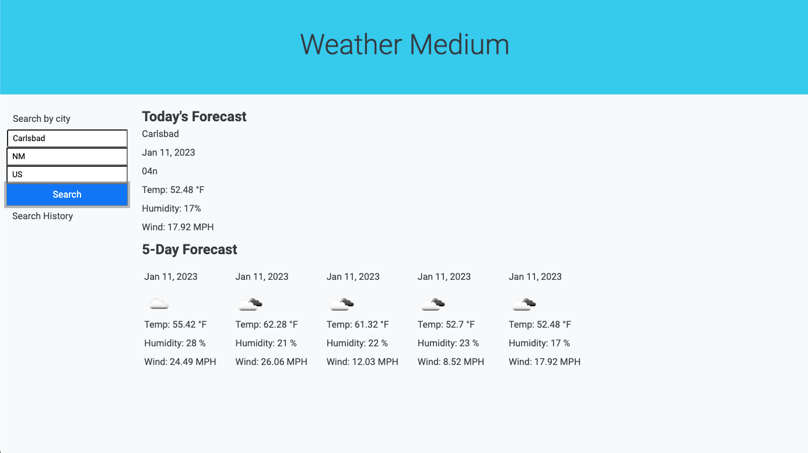

# Weather Medium

## Description

This weather app was an assignment from coding bootcamp.

The user can input a city, state, and country and click the search button to receive the forecast for that day and the 5 day forecast. The city is added to a search history after it is entered. Unfortnately, I was unable to create code that adds multiple cities to the search history that can be clicked to re-render that city's weather forecast. 

## Installation

This web page runs on most browsers. You can visit the deployed link here: https://steviemiller.github.io/weather-medium/

## Screenshots
